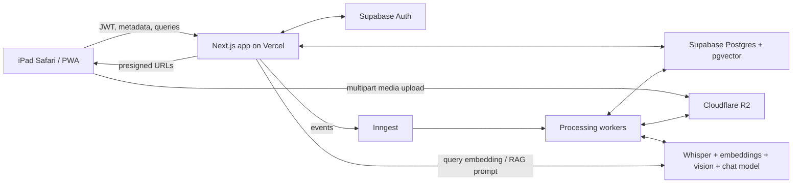
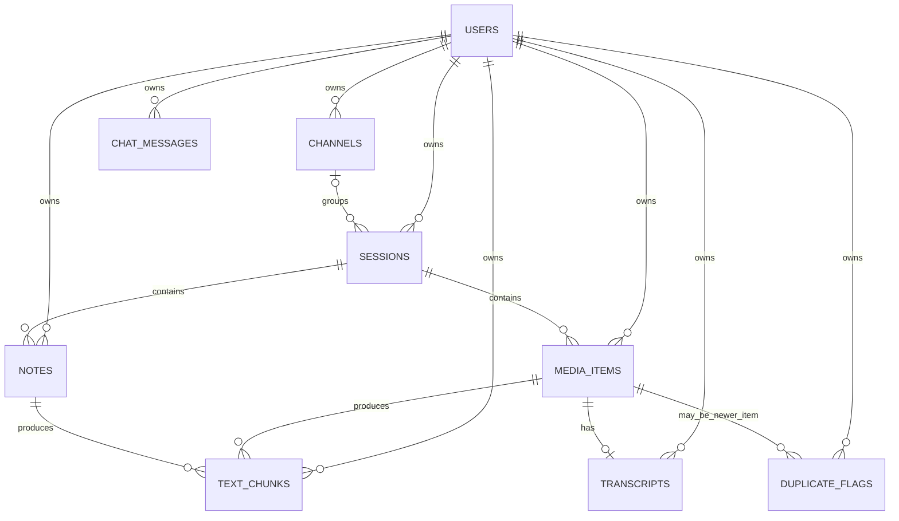
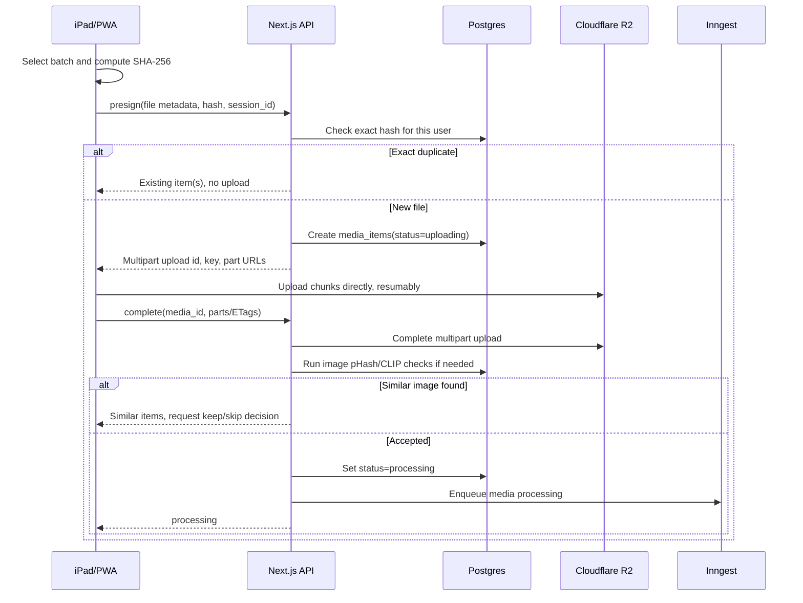
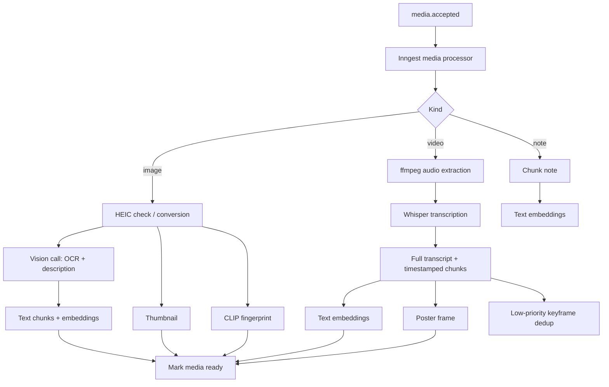

# MasterClass Knowledge Base — Architecture

**Status:** Initial implementation architecture  
**Date:** July 12, 2026  
**Source documents:** [MVP technical design](masterclass-kb-mvp-spec.md) · [Build spec and MVP plan](masterclass-kb-build-spec.md)

This document turns the two specifications into an implementation map. The specifications remain the product and technical source of truth; this file explains how their parts fit together and in what order to build them.

## 1. Architectural goal

Build a private, single-user-at-a-time knowledge base for recorded master classes. The user selects a batch of recordings, screenshots, and notes from an iPad. The system stores the files, extracts searchable knowledge in the background, and provides:

- a chronological and channel-organized library;
- precise search results that open the matching screenshot, note span, or video timestamp;
- multilingual RAG chat grounded only in the user's material;
- deduplication warnings without automatic deletion.

The architecture is designed around five rules:

1. Large files bypass the application server and go directly to object storage.
2. The database stores metadata, relationships, text, vectors, and storage pointers—not media bytes.
3. Upload acknowledgement is fast; expensive work is asynchronous.
4. Every user-owned record is protected by Postgres RLS and every signed storage URL is ownership-checked.
5. Classification is optional: an unsorted session is a normal session whose `channel_id` is `null`.

## 2. System shape



### Runtime responsibilities

| Component | Responsibility | Must not do |
|---|---|---|
| Next.js frontend | iPad-first UI, batch selection, upload orchestration, library, search, chat, status display | Hold service secrets or upload large files through Vercel |
| Next.js server/API | Authenticate requests, create metadata, presign R2 operations, issue signed download URLs, query Postgres, start jobs | Trust a client-supplied `user_id` or expose public media URLs |
| Supabase Auth | Email/password login, account creation, JWT issuance, refresh sessions | Store application media metadata |
| Postgres + pgvector | Relational model, ownership enforcement, text chunks, vector retrieval, chat history | Store original video/image bytes |
| Cloudflare R2 | Original media, thumbnails, posters, optional playback derivatives | Be public or accessed without a short-lived signed URL |
| Inngest | Durable events, retries, fan-out, scheduling, low-priority work | Be the source of truth for item status |
| Workers | Audio extraction, transcription, OCR/vision, thumbnails, embeddings, video dedup, purge | Run non-idempotent steps that create duplicate chunks on retry |

For local development, Phase 2 uses a private Supabase Storage bucket with the same user-scoped key layout. The application reaches storage through a small adapter boundary; production will use Cloudflare R2 and presigned multipart uploads without changing the session/media API or library UI.

## 3. Domain model

The model has two independent axes:

- **Channel:** where information comes from; optional organization.
- **Session:** one delivered class and one upload batch; the recording anchors it.

Dates are also independent:

- **Event time:** when the class or capture happened (`session_date`, `captured_at`).
- **Ingestion time:** when the system received the record (`created_at`).



### Tables and important constraints

| Table | Purpose | Important constraints/indexes |
|---|---|---|
| `users` | App profile mirroring `auth.users` | PK equals `auth.users.id`; created by signup trigger |
| `channels` | Named master-class source | `user_id` required; unique name per user is recommended |
| `sessions` | One class/upload batch | `channel_id` nullable; `session_date` and `deleted_at` nullable |
| `media_items` | File metadata and dedup fingerprints | `file_hash` indexed per user; status, ownership, and a safe processing-error field required |
| `notes` | User-authored text | Belongs to one session; edits replace its derived chunks |
| `transcripts` | Full downloadable video transcript | One transcript per video; language stored |
| `text_chunks` | Search and RAG retrieval units | 1536-dimensional text vector; locator fields preserved |
| `duplicate_flags` | Non-destructive suspected duplicate record | `open`, `dismissed`, or `resolved` |
| `chat_messages` | Optional persistent chat history | User-scoped; citations stored as JSONB |

Add the build-spec fields to `media_items`: `thumbnail_key`, `duration_ms`, `width`, `height`, and `deleted_at`. Add `deleted_at` to `sessions` and `notes`.

Recommended indexes:

- B-tree on `(user_id, created_at desc)` for library lists.
- B-tree on `(user_id, file_hash)` for exact deduplication.
- B-tree on `(user_id, session_id)` for session detail loading.
- B-tree on `(user_id, status)` for processing views.
- HNSW or IVFFlat cosine index on `text_chunks.embedding`.
- Vector index on `media_items.clip_embedding` if supported by the selected pgvector version.
- Partial indexes that exclude soft-deleted rows where practical.

The text and image vectors are different types of evidence and must never be used interchangeably:

- `text_chunks.embedding` is a 1536-dimensional multilingual text vector for search and chat.
- `media_items.clip_embedding` is a 512-dimensional visual fingerprint for image deduplication only.

## 4. Trust and security boundaries

### Request path

1. The frontend obtains a Supabase JWT through email/password authentication.
2. Every API request sends `Authorization: Bearer <jwt>`.
3. The server validates the token and derives `user_id` from it.
4. Database operations use the authenticated identity and RLS policies.
5. The server returns only short-lived signed R2 URLs after checking the owning `media_items` row.

`user_id` is never accepted as an authority-bearing field from the request body.

### RLS policy

Enable RLS on every application table. The normal policy is:

```sql
using (user_id = auth.uid())
with check (user_id = auth.uid())
```

Apply it to `channels`, `sessions`, `media_items`, `notes`, `text_chunks`, `transcripts`, `duplicate_flags`, and `chat_messages`. `users` receives a self-only policy.

Vector retrieval must include an explicit user predicate in addition to RLS. Retrieval must also exclude soft-deleted content. Since `text_chunks` points to several source types, the search function should validate the live source/session through joins or a server-side SQL function rather than relying on the client to filter deleted data.

Background workers use an internal credential because they run without the browser JWT. Their event payloads are generated server-side, and every worker query is scoped by the `media_id` and `user_id` in that event. Workers must not expose a public endpoint that accepts arbitrary internal identifiers.

### R2 isolation

Use a private bucket and keys shaped as:

```text
users/{user_id}/{media_id}/original.{ext}
users/{user_id}/{media_id}/thumb.jpg
users/{user_id}/{media_id}/poster.jpg
users/{user_id}/{media_id}/playback.mp4   # optional, only if transcoding is enabled
```

The backend checks ownership before issuing either upload or download signatures. Signed URLs should expire quickly, for example after five minutes. No R2 bucket or object is public.

## 5. Upload and session architecture

### Batch semantics

One user-selected batch becomes one session. The UI should create or initialize that session silently before starting file uploads; the user is asked for at most one date for the batch. The session begins unsorted and can later be assigned to a channel.

The cleanest implementation is a small batch initialization operation that returns a `session_id` and accepts the inferred/default session date. All subsequent presign requests carry that `session_id`. If the first implementation keeps the existing endpoint set, the first presign can create the session and return the id for the remaining files; the behavior must still be atomic and invisible to the user.

### Fast lane



Use Uppy with `AwsS3Multipart`, a concurrency cap of roughly 3–4, and resumable multipart uploads. Vercel never receives the media bytes.

### Deduplication states

The database status remains the processing lifecycle (`uploading`, `processing`, `ready`, `failed`). The upload workflow also needs a durable decision state for a completed upload awaiting the user's similarity choice—either `dedup_review` as an additional status or a small upload-review field. This prevents a browser refresh from losing the item. The API contract's `confirm` operation must be idempotent.

Deduplication behavior:

1. SHA-256 before upload: exact duplicate, immediate warning, no new object.
2. pHash after image upload: near-identical image warning.
3. CLIP cosine after image upload: visually similar image warning.
4. Video keyframes in a low-priority job: library badge only.

Warnings never delete automatically. Skipping a newly uploaded image deletes its R2 object and soft-deletes or removes its pending row according to the final upload-state implementation.

### Date and format handling

- Prefer video container metadata for the batch event date.
- Show one prefilled date prompt per batch when metadata is missing or unreliable.
- Preserve original HEIC and video uploads.
- Convert HEIC server-side only when needed for processing or display.
- Extract audio server-side with ffmpeg.
- Defer HEVC-to-H.264 playback transcoding until in-app rewatch is confirmed necessary.

## 6. Background processing architecture

Every processing function is keyed by `media_id`, safe to retry, and safe to run more than once. Before inserting derived data, it deletes or upserts the prior derived records for that source.



### Processing details

**Image:** convert HEIC if necessary, make the thumbnail, call the vision model once for OCR and description, store two chunk types, and embed both. CLIP is computed early enough to support upload-time dedup and stored canonically on `media_items`.

**Video:** extract audio, call `whisper-1` with automatic language detection, store the full transcript, create rolling timestamped chunks, embed them, and generate a poster. The baseline chunker uses approximately three sentences with one sentence of overlap and keeps tight first/last segment timestamps.

**Note:** create or replace sentence-based rolling chunks with `char_start` and `char_end`; edits delete the old chunks and enqueue a fresh note job.

**Failure:** after retry exhaustion, set `media_items.status=failed` and store a safe, user-facing error reason. A retry action re-enqueues the same idempotent job.

**Completion:** only mark an item `ready` after all required derived data for its kind exists. Partial batch failures are independent and must not block sibling items.

## 7. Status, realtime, and deletion lifecycle

`media_items.status` is the source of truth for the UI:

```text
uploading → processing → ready
                 └────→ failed
```

Store a non-sensitive `processing_error` or `processing_error_code` when an item reaches `failed`. The UI maps that code to friendly copy and a retry action; provider error text must not be exposed directly.

Supabase Realtime publishes changes to the user's `media_items` rows. The library subscribes to status changes and falls back to polling `GET /api/media/:id` if the subscription is unavailable.

Deletion is soft and immediate:

1. Deleting a session sets `deleted_at` on the session, its media, and its notes.
2. Library, search, chat, transcript, and signed-URL queries exclude deleted roots.
3. A daily purge job finds records older than 30 days, deletes their R2 originals/thumbnails/posters, and then hard-deletes derived chunks, transcripts, duplicate flags, and database rows.
4. Purge is idempotent and tolerant of already-missing R2 objects.

This gives the user an undo window while preventing orphaned files and vectors.

## 8. Search and chat architecture

Search and chat share the same retrieval layer but have different jobs.

### Search

1. Embed the query with `text-embedding-3-small`.
2. Query `text_chunks` with cosine similarity, explicit `user_id`, and live-source filters.
3. Retrieve a moderate candidate set, for example `k=30`.
4. Group or rank hits for useful browsing.
5. Return the source locator with every result.

Locator rules:

- transcript: `media_id`, `start_ms`, `end_ms`;
- image: `media_id` and thumbnail/display URL;
- note: `note_id`, `char_start`, `char_end`.

The frontend owns the landing behavior: seek a video to `start_ms`, open the exact screenshot, or highlight the note span.

### Chat

1. Embed the question with the same embedding model.
2. Retrieve user-scoped, non-deleted chunks.
3. Build a prompt containing snippets and source identifiers.
4. Ask the chat model to answer only from the supplied context.
5. Stream the answer and return structured citations.
6. Instruct the model to answer in the user's language and say when the material does not contain the answer.

The frontend renders citations as tappable links using the same locator rules as search. Chat history can be persisted in `chat_messages`; if the first MVP keeps chat ephemeral, the table and endpoint shape should remain compatible with adding persistence later.

## 9. API boundary

All endpoints require a bearer JWT. Responses use JSON and errors use:

```json
{ "error": { "code": "...", "message": "..." } }
```

List endpoints use `limit` and cursor pagination. Mutating upload operations are idempotent on `file_hash` and/or `media_id`.

### API groups

| Group | Endpoints |
|---|---|
| Upload | `POST /api/uploads/presign`, `POST /api/uploads/complete`, `POST /api/uploads/:id/confirm` |
| Session/channel | `GET/POST /api/sessions`, `GET/PATCH/DELETE /api/sessions/:id`, channel CRUD |
| Media | `GET /api/media/:id`, `DELETE /api/media/:id` |
| Transcript | `GET /api/media/:id/transcript`, transcript download as PDF or text |
| Notes | `POST/PATCH/DELETE /api/notes` and `/api/notes/:id` |
| Retrieval | `GET /api/search?q=`, `POST /api/chat` |
| Duplicates | `GET /api/duplicates`, `POST /api/duplicates/:id/resolve` |

The session initialization operation described in §5 should be implemented as `POST /api/sessions` or an equivalent batch-specific endpoint so a batch has a stable session before its files are uploaded.

## 10. Frontend structure

The project is empty today. A practical Next.js structure is:

```text
app/
  (auth)/login/
  (app)/library/
  (app)/sessions/[id]/
  (app)/search/
  (app)/chat/
  api/
components/
  upload/
  library/
  media/
  search/
  chat/
lib/
  auth/
  db/
  storage/
  embeddings/
  processing/
  validation/
inngest/
  functions/
supabase/migrations/
tests/
```

Keep provider-specific code behind small adapters (`r2`, `transcription`, `vision`, `embeddings`, `chat`) so an overridable provider can change without rewriting domain flows.

## 11. Deployment and environment

Provision:

- Supabase project with Auth, Postgres, pgvector, and Realtime;
- private Cloudflare R2 bucket and S3-compatible credentials;
- Vercel project for Next.js;
- Inngest app and signing key;
- OpenAI credentials for Whisper, embeddings, and the selected vision/chat models.

Server-only environment variables include `SUPABASE_SERVICE_ROLE_KEY`, R2 secrets, Inngest signing credentials, and model API keys. The browser may receive only the public Supabase URL/key and short-lived signed URLs.

## 12. Build order

Build the thin end-to-end thread first, then widen it:

| Phase | Deliverable | Acceptance check |
|---|---|---|
| 0 | Provision services, migrations, pgvector, RLS, signup trigger | Migrations pass; another user cannot see seeded rows |
| 1 | Email/password auth and profile sync | User can create an account, sign in, and access only their empty library |
| 2 | One-image walking-skeleton upload | Image reaches private R2 and row moves `uploading → processing` |
| 3 | Image processing | Vision chunks, embedding, CLIP fingerprint, thumbnail, and live `ready` status exist |
| 4 | Signed media display and library | User can browse/open own image and not another user's image |
| 5 | Video processing | Transcript, download, poster, playback, and timestamp seek work |
| 6 | Search and chat | Spanish search works; hits land precisely; chat streams citations |
| 7 | Deduplication | Exact/near duplicate warnings work; video flags appear later in library |
| 8 | Notes and management | Note edits are searchable; channel assignment, unsorted view, and soft delete work |
| 9 | Hardening | Retry, validation, empty states, rate limits, and cost guardrails work |

Each phase should be demonstrable before starting the next. The full acceptance scenario is the 15-step script in the build spec; it is the final MVP gate.

## 13. Decisions intentionally left open

These are the only meaningful product/implementation threads left open in the supplied specifications:

- whether in-app video rewatch requires HEVC-to-H.264 transcoding;
- whether chat history is persistent in the first release;
- exact provider/model for the general chat LLM;
- final pHash and CLIP thresholds after testing real screenshots;
- final image/video size, batch, and rate limits;
- whether `dedup_review` is represented as a new media status or a separate upload-review field.

All other architecture decisions in this document are treated as committed for MVP implementation.
