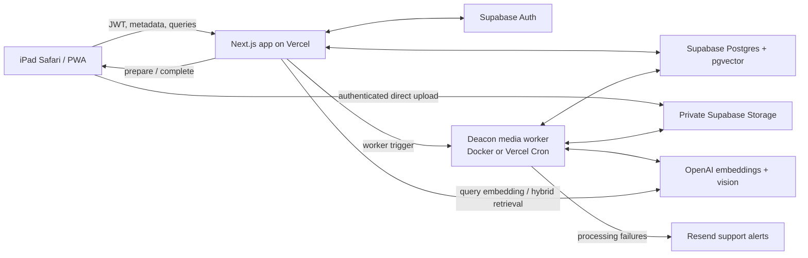
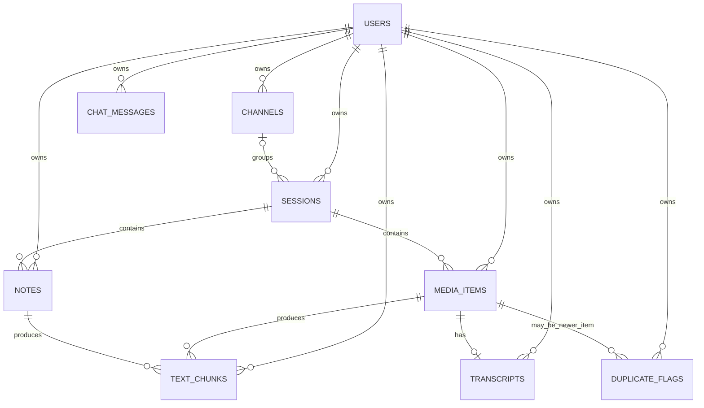
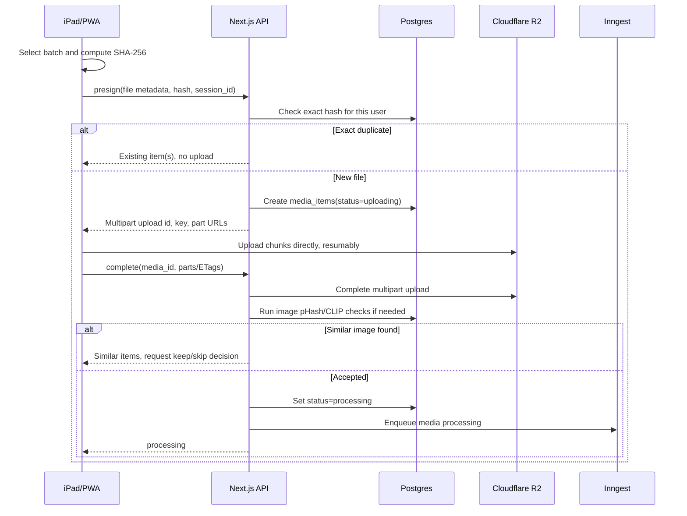
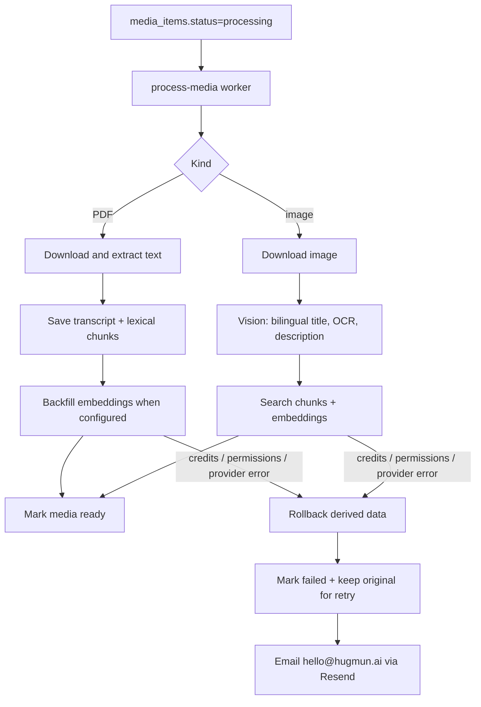

# MasterClass Knowledge Base — Architecture

**Status:** Implemented MVP architecture
**Date:** July 22, 2026
**Source documents:** [MVP technical design](masterclass-kb-mvp-spec.md) · [Build spec and MVP plan](masterclass-kb-build-spec.md)

This document turns the two specifications into an implementation map. The specifications remain the product and technical source of truth; this file explains how the deployed Deacon implementation fits together, including the current Supabase Storage path and the future R2/Inngest migration boundary.

## 1. Architectural goal

Build a private, single-user-at-a-time knowledge base for recorded master classes. The user selects a batch of recordings, screenshots, and notes from an iPad. The system stores the files, extracts searchable knowledge in the background, and provides:

- a chronological and channel-organized library;
- precise search results that open the matching screenshot, note span, or video timestamp;
- multilingual RAG chat grounded only in the user's material;
- deduplication warnings without automatic deletion.

The architecture is designed around five rules:

1. Large files bypass the application server and go directly to object storage.
2. The database stores metadata, relationships, text, optional vectors, and storage pointers—not media bytes.
3. Upload acknowledgement is fast; expensive work is asynchronous.
4. Every user-owned record is protected by Postgres RLS and every signed storage URL is ownership-checked.
5. Classification is optional: an unsorted session is a normal session whose `channel_id` is `null`.

## 2. System shape



### Runtime responsibilities

| Component | Responsibility | Must not do |
|---|---|---|
| Next.js frontend | iPad-first UI, file selection/drag and drop, library virtualization, search, image viewer, PDF reader, status display | Hold service secrets or upload large files through Vercel |
| Next.js server/API | Authenticate requests, create metadata, verify Storage uploads, issue signed download URLs, query Postgres, expose worker/health endpoints | Trust a client-supplied `user_id` or expose public media URLs |
| Supabase Auth | Email/password login, account creation, JWT issuance, refresh sessions | Store application media metadata |
| Postgres + pgvector | Relational model, RLS ownership enforcement, text chunks, lexical/vector retrieval, processing status, recycle-bin metadata | Store original media bytes |
| Private Supabase Storage | Original PDFs/images under user-scoped keys and signed media access | Be public or accessed without authenticated ownership checks |
| Deacon media worker | PDF extraction, image vision analysis, chunks, embeddings, stale-upload cleanup, recycle-bin purge, health heartbeat | Leave partial derived data after a failed indexing operation |
| OpenAI | Image understanding and text embeddings; query embeddings for semantic search | Be assumed available without quota/permission handling |
| Resend | Operational email alerts to `hello@hugmun.ai` for processing failures | Be required for the upload itself to complete |

The current deployment uses a private Supabase Storage bucket. The browser uploads directly after `/api/uploads/prepare`, and `/api/uploads/complete` verifies the object before queuing processing. Cloudflare R2 and presigned multipart uploads remain a future storage migration; they should preserve the same session/media API and library UI.

## 3. Domain model

The model has two independent axes:

- **Channel:** where information comes from; optional organization.
- **Session:** one delivered class and one upload batch; the recording anchors it.

Dates are also independent:

- **Event time:** when the class or capture happened (`session_date`, `captured_at`).
- **Ingestion time:** when the system received the record (`created_at`).



### Tables and important constraints

| Table | Purpose | Important constraints/indexes |
|---|---|---|
| `users` | App profile mirroring `auth.users` | PK equals `auth.users.id`; created by signup trigger |
| `channels` | Named master-class source | `user_id` required; unique name per user is recommended |
| `sessions` | One class/upload batch | `channel_id` nullable; `session_date` and `deleted_at` nullable |
| `media_items` | File metadata and dedup fingerprints | `file_hash` indexed per user; status, ownership, and a safe processing-error field required |
| `notes` | User-authored text | Belongs to one session; edits replace its derived chunks |
| `transcripts` | Full downloadable video transcript | One transcript per video; language stored |
| `text_chunks` | Search and RAG retrieval units | Optional 1536-dimensional text vector plus lexical `search_vector`; locator fields preserved |
| `duplicate_flags` | Non-destructive suspected duplicate record | `open`, `dismissed`, or `resolved` |
| `chat_messages` | Optional persistent chat history | User-scoped; citations stored as JSONB |

Add the build-spec fields to `media_items`: `thumbnail_key`, `duration_ms`, `width`, `height`, and `deleted_at`. Add `deleted_at` to `sessions` and `notes`.

Recommended indexes:

- B-tree on `(user_id, created_at desc)` for library lists.
- B-tree on `(user_id, file_hash)` for exact deduplication.
- B-tree on `(user_id, session_id)` for session detail loading.
- B-tree on `(user_id, status)` for processing views.
- HNSW or IVFFlat cosine index on `text_chunks.embedding`.
- Vector index on `media_items.clip_embedding` if supported by the selected pgvector version.
- Partial indexes that exclude soft-deleted rows where practical.

The text and image vectors are different types of evidence and must never be used interchangeably:

- `text_chunks.embedding` is an optional 1536-dimensional multilingual text vector for semantic search and chat; `search_vector` supports lexical fallback.
- `media_items.clip_embedding` is a 512-dimensional visual fingerprint for image deduplication only.

## 4. Trust and security boundaries

### Request path

1. The frontend obtains a Supabase JWT through email/password authentication.
2. Every API request sends `Authorization: Bearer <jwt>`.
3. The server validates the token and derives `user_id` from it.
4. Database operations use the authenticated identity and RLS policies.
5. The server returns only short-lived signed Supabase Storage URLs after checking the owning `media_items` row.

`user_id` is never accepted as an authority-bearing field from the request body.

### RLS policy

Enable RLS on every application table. The normal policy is:

```sql
using (user_id = auth.uid())
with check (user_id = auth.uid())
```

Apply it to `channels`, `sessions`, `media_items`, `notes`, `text_chunks`, `transcripts`, `duplicate_flags`, and `chat_messages`. `users` receives a self-only policy.

Vector retrieval must include an explicit user predicate in addition to RLS. Retrieval must also exclude soft-deleted content. Since `text_chunks` points to several source types, the search function should validate the live source/session through joins or a server-side SQL function rather than relying on the client to filter deleted data.

Background workers use an internal credential because they run without the browser JWT. Their event payloads are generated server-side, and every worker query is scoped by the `media_id` and `user_id` in that event. Workers must not expose a public endpoint that accepts arbitrary internal identifiers.

### Storage isolation

Use a private bucket and keys shaped as:

```text
users/{user_id}/{media_id}/original.{ext}
users/{user_id}/{media_id}/thumb.jpg
users/{user_id}/{media_id}/poster.jpg
users/{user_id}/{media_id}/playback.mp4   # optional, only if transcoding is enabled
```

The current backend checks ownership before issuing signed Supabase Storage download URLs. Signed URLs expire quickly, currently five minutes. The bucket is private. The same key layout and ownership rules apply if storage moves to R2 later.

## 5. Upload and session architecture

### Current deployed upload flow

The production MVP currently accepts one PDF or image at a time through the browser and private Supabase Storage:

1. The browser normalizes HEIC when needed and computes a SHA-256 hash.
2. `POST /api/uploads/prepare` authenticates the user, creates or reuses a session, checks exact duplicates, and creates a `media_items` row with `status=uploading`.
3. The browser uploads the file directly to the private `media` bucket.
4. `POST /api/uploads/complete` verifies that the Storage object exists and moves the row to `status=processing`.
5. The media worker processes the row asynchronously. The browser polls the status endpoint and renders an estimated progress value while the worker reports coarse stages.
6. A stale `uploading` row older than 15 minutes is marked `failed` with `processing_error_code=upload_incomplete`, so it cannot remain at `0%` forever.

The original file is retained when processing fails so the user can retry after the cause is fixed. Exact duplicates and items recovered from the recycle bin are handled before a new Storage upload is started.

### Batch semantics

The current UI lets the user select multiple files, processes them sequentially, and automatically creates or reuses one session for the batch using the local date. The session begins unsorted and can later be assigned to a channel.

`POST /api/uploads/prepare` performs the session initialization as part of preparing each file; the browser does not need to manage a separate session initialization request.

### Future multipart lane

The following sequence is the planned R2/Inngest version, not the current Supabase Storage deployment:



The current Supabase Storage implementation uploads directly from the browser. The planned R2 migration may use Uppy with `AwsS3Multipart`, a concurrency cap of roughly 3–4, and resumable multipart uploads; Vercel should never receive the media bytes.

### Deduplication states

The database status remains the processing lifecycle (`uploading`, `processing`, `ready`, `failed`). The upload workflow also needs a durable decision state for a completed upload awaiting the user's similarity choice—either `dedup_review` as an additional status or a small upload-review field. This prevents a browser refresh from losing the item. The API contract's `confirm` operation must be idempotent.

Deduplication behavior:

1. SHA-256 before upload: exact duplicate, immediate warning, no new object.
2. pHash after image upload: near-identical image warning.
3. CLIP cosine after image upload: visually similar image warning.
4. Video keyframes in a low-priority job: library badge only.

Warnings never delete automatically. Skipping a newly uploaded image deletes its Storage object and soft-deletes or removes its pending row according to the final upload-state implementation.

### Date and format handling

- Prefer video container metadata for the batch event date.
- Show one prefilled date prompt per batch when metadata is missing or unreliable.
- Preserve original HEIC and video uploads.
- Convert HEIC server-side only when needed for processing or display.
- Extract audio server-side with ffmpeg.
- Defer HEVC-to-H.264 playback transcoding until in-app rewatch is confirmed necessary.

## 6. Background processing architecture

Every processing function is keyed by `media_id`, safe to retry, and safe to run more than once. Before inserting derived data, it deletes or upserts the prior derived records for that source.



### Processing details

**Image:** convert HEIC in the browser if necessary, call the vision model once for bilingual titles, OCR, description, concepts, and keywords, then store searchable image chunks and embeddings. The Spanish title is the primary library title; the English title remains searchable and visible as secondary metadata.

**PDF:** download from private Storage, extract text, store the full transcript and overlapping chunks, then backfill embeddings. If `OPENAI_API_KEY` is absent, lexical search can continue with chunks whose embedding is `null`. If the embedding provider rejects a request because of quota, billing, permission, or authentication, the worker deletes the transcript and all chunks for that media item, clears derived image metadata, marks the item `failed`, and leaves the original file available for retry.

**Video:** video processing remains a future phase. The planned lane extracts audio, calls `whisper-1`, stores timestamped chunks, embeds them, and generates a poster.

**Note:** create or replace sentence-based rolling chunks with `char_start` and `char_end`; edits delete the old chunks and enqueue a fresh note job.

**Failure:** every worker error records a safe `processing_error_code`, responsible service, optional provider request ID, and user-facing message. Embedding/vision credit and configuration failures roll back derived data before setting `media_items.status=failed`. The worker sends a technical alert to `hello@hugmun.ai` through Resend when `RESEND_API_KEY` and `RESEND_FROM_EMAIL` are configured. Email failure is logged but never causes the worker to crash. The library offers `Reintentar` and, for failed items, `Borrar` with the same 30-day recycle-bin confirmation.

**Completion:** image processing marks an item `ready` only after vision-derived chunks are saved. PDF lexical chunks can make an item searchable without embeddings when the embedding key is absent; when embedding is attempted and fails, the item is failed and rolled back. Partial batch failures are independent and must not block sibling items.

## 7. Status, realtime, and deletion lifecycle

`media_items.status` is the source of truth for the UI:

```text
uploading → processing → ready
                 └────→ failed
```

Store a non-sensitive `processing_error_code`, `processing_error_service`, `processing_error_message`, and optional `processing_error_request_id` when an item reaches `failed`. The UI maps the code to friendly copy and a retry action; provider error text must not be exposed directly.

The library currently polls `GET /api/media/:id/status` while an item is active, with estimated progress so a slow worker does not appear frozen. The worker also writes a heartbeat to `service_health`; `/api/health` reports when that heartbeat is stale.

Deletion is soft and immediate:

1. The user deletes an opened image/PDF, or a failed item from its status actions; the UI always asks for confirmation.
2. `DELETE /api/media/:id` sets `deleted_at` immediately. Library, search, MCP, transcript, and signed-URL queries exclude deleted roots.
3. The worker finds deleted records older than 30 days, removes their Supabase Storage objects, derived chunks, transcripts, and database rows.
4. `POST /api/media/:id` restores content deleted within 30 days. Exact re-uploads can also recover a matching item from the recycle bin.
5. Purge is idempotent and tolerant of already-missing Storage objects.

This gives the user an undo window while preventing orphaned files and vectors.

## 8. Search and chat architecture

Search and chat share the same retrieval layer but have different jobs.

### Search

1. Always run PostgreSQL lexical search over processed chunks.
2. When the embedding provider is configured and available, embed the query with `text-embedding-3-small` and add cosine similarity results.
3. Query with explicit `user_id` and live-source filters.
4. Retrieve a moderate candidate set, group/rank hits, and return the source locator with every result.

The search word itself is embedded only for that search request; document and image embeddings are created once during processing and reused. If query embedding fails because of credits or provider availability, lexical results are returned with a notice. If document/image embedding fails during ingestion, the ingestion is rolled back and the item is marked failed instead of being silently indexed only partially.

Locator rules:

- transcript: `media_id`, `start_ms`, `end_ms`;
- image: `media_id` and thumbnail/display URL;
- note: `note_id`, `char_start`, `char_end`.

The frontend owns the landing behavior: seek a video to `start_ms`, open the exact screenshot, or highlight the note span.

### Chat

1. Embed the question with the same embedding model.
2. Retrieve user-scoped, non-deleted chunks.
3. Build a prompt containing snippets and source identifiers.
4. Ask the chat model to answer only from the supplied context.
5. Stream the answer and return structured citations.
6. Instruct the model to answer in the user's language and say when the material does not contain the answer.

The frontend renders citations as tappable links using the same locator rules as search. Chat history can be persisted in `chat_messages`; if the first MVP keeps chat ephemeral, the table and endpoint shape should remain compatible with adding persistence later.

## 9. API boundary

All endpoints require a bearer JWT. Responses use JSON and errors use:

```json
{ "error": { "code": "...", "message": "..." } }
```

List endpoints use `limit` and cursor pagination. Mutating upload operations are idempotent on `file_hash` and/or `media_id`.

### API groups

| Group | Endpoints |
|---|---|
| Upload | `POST /api/uploads/prepare`, `POST /api/uploads/complete` |
| Session | `GET/POST /api/sessions` |
| Media | `GET /api/media`, `GET /api/media/:id`, `DELETE /api/media/:id`, `POST /api/media/:id` (restore), `GET /api/media/trash` |
| Processing | `GET /api/media/:id/status`, `POST /api/media/:id/retry`, `GET /api/worker/process` |
| Transcript | `GET /api/media/:id/transcript`, transcript download as PDF or text |
| Notes | `POST/PATCH/DELETE /api/notes` and `/api/notes/:id` |
| Retrieval | `GET /api/search?q=`, read-only MCP tools through `/api/mcp` and `/mcp` |
| Operations | `GET /api/health`, `GET /api/diagnostics` |

The current upload implementation creates or reuses the session inside `/api/uploads/prepare`, so the browser does not need a separate session-initialization step.

## 10. Frontend structure

The implemented Next.js structure is:

```text
app/
  (auth)/login/
  (app)/library/
  (app)/search/
  (app)/trash/
  api/
components/
  upload/
  library/
  media/
  search/
lib/
  auth/
  db/
  storage/
  embeddings/
  processing/
  validation/
supabase/migrations/
scripts/process-media.mjs
test/
```

The library uses cursor pagination and virtualized page mounting so large libraries do not mount every card at once. Images open in an iPad-friendly full-screen viewer; PDFs open one at a time in an inline transcript reader. Delete controls are intentionally absent from cards and appear only in the opened viewer/reader or failed-item status actions.

Keep provider-specific code behind small adapters (`storage`, `vision`, `embeddings`, `chat`) so an overridable provider can change without rewriting domain flows.

## 11. Deployment and environment

Provision:

- Supabase project with Auth, Postgres, pgvector, and Realtime;
- private Supabase Storage `media` bucket and storage policies;
- Vercel project for Next.js;
- OpenAI credentials for embeddings and the selected vision model;
- an always-on worker container or Vercel Cron for `GET /api/worker/process`;
- Resend credentials for operational alerts to `hello@hugmun.ai`.

Server-only environment variables include `SUPABASE_SERVICE_ROLE_KEY`, `OPENAI_API_KEY`, `WORKER_SECRET`, `RESEND_API_KEY`, and `RESEND_FROM_EMAIL`. The browser may receive only the public Supabase URL/key and short-lived signed URLs. R2/Inngest are future migration options, not prerequisites for the current MVP.

## 12. Build order

Build the thin end-to-end thread first, then widen it:

| Phase | Deliverable | Acceptance check |
|---|---|---|
| 0 | Provision services, migrations, pgvector, RLS, signup trigger | Migrations pass; another user cannot see seeded rows |
| 1 | Email/password auth and profile sync | User can create an account, sign in, and access only their empty library |
| 2 | One-image walking-skeleton upload | Image reaches private Supabase Storage and row moves `uploading → processing` |
| 3 | Image processing | Vision titles, searchable chunks, embeddings, and live `ready` status exist |
| 4 | Signed media display and library | User can browse/open own image, with iPad viewer and virtualized library pages |
| 5 | Video processing | Transcript, download, poster, playback, and timestamp seek work |
| 6 | Search and chat | Spanish search works; hits land precisely; chat streams citations |
| 7 | Deduplication | Exact/near duplicate warnings work; video flags appear later in library |
| 8 | Notes and management | Note edits are searchable; channel assignment, unsorted view, and soft delete work |
| 9 | Hardening | Retry, rollback on provider/credit failure, support alerts, recycle bin, validation, and cost guardrails work |

Each phase should be demonstrable before starting the next. The full acceptance scenario is the 15-step script in the build spec; it is the final MVP gate.

## 13. Decisions intentionally left open

These are the only meaningful product/implementation threads left open in the supplied specifications:

- whether in-app video rewatch requires HEVC-to-H.264 transcoding;
- whether chat history is persistent in the first release;
- exact provider/model for the general chat LLM;
- final pHash and CLIP thresholds after testing real screenshots;
- final image/video size, batch, and rate limits;
- whether `dedup_review` is represented as a new media status or a separate upload-review field.

All other architecture decisions in this document are treated as committed for MVP implementation.
