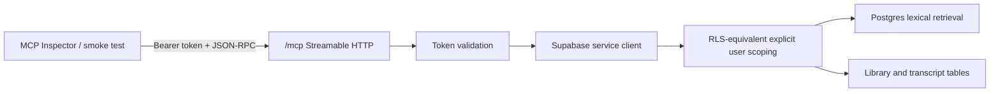

# Deacon MCP architecture

**Status:** remote OAuth foundation · **Date:** July 20, 2026

Deacon exposes a read-only Model Context Protocol server so an authorized assistant can search the user's private master-class material and read the source text needed for grounded answers.

## Current local flow



The endpoint is available at `/mcp` and `/api/mcp`. The second path is kept as an internal-compatible alias while `/mcp` is the public integration path.

## Tools implemented

| Tool | Purpose | Write access |
|---|---|---|
| `search_knowledge` | Search transcripts, notes, and image-derived text through PostgreSQL full-text search | None |
| `list_library` | List owned media and processing states | None |
| `get_transcript` | Read one complete owned transcript | None |

Every tool receives the authenticated user id from the server-side token validation path. The user id is not accepted as a tool argument. Queries also include an explicit user predicate and exclude deleted sources.

## Authentication modes

1. In production, ChatGPT uses the OAuth 2.1 authorization-code + PKCE flow exposed by `/oauth/authorize` and `/oauth/token`. The OAuth access token is audience-bound to `MCP_PUBLIC_URL` and maps to the authenticated Deacon user.
2. A Supabase access token in `Authorization: Bearer <jwt>` is still accepted for local and service-level testing.
3. A static `MCP_DEV_TOKEN` plus `MCP_DEV_USER_ID` can be used only for local Inspector/smoke tests. This is a development convenience and is not a production authentication design.

The OAuth discovery endpoints are:

- `/.well-known/oauth-protected-resource`
- `/.well-known/oauth-authorization-server`
- `/oauth/authorize`
- `/oauth/token`

Production must set `MCP_PUBLIC_URL` to the canonical HTTPS `/mcp` URL and provide a long random `MCP_OAUTH_SIGNING_SECRET`. The authorization flow reuses the normal Deacon login and only grants the `knowledge:read` scope.

## Connect the production server to ChatGPT

The one-time connector URL is:

```text
https://deacon.vercel.app/mcp
```

When ChatGPT opens it, Deacon redirects to its normal login, asks for consent, and issues a token bound to that Deacon account. After the connection is saved, the same private library is available from any ChatGPT conversation where that connector is enabled. The ChatGPT account and the Deacon account are linked by the Deacon login during the connection; they are not implicitly the same identity.

Verify the deployed configuration without credentials with:

```bash
npm run test:mcp:remote
```

Run the smoke test against a local app with:

```bash
MCP_TEST_TOKEN=local-test-token npm run test:mcp
```

When using the static token, start the app with matching `MCP_DEV_TOKEN` and `MCP_DEV_USER_ID` values.

## Remaining production prerequisites

- HTTPS deployment for the app and MCP endpoint, with the ChatGPT redirect URI allowlisted by the OAuth server.
- MCP Inspector coverage for discovery, authorization failures, tool schemas, empty results, and deleted-content isolation.
- Rate limits and audit logging for remote MCP requests.
- Chat/RAG tool only after citation formatting, prompt-injection defenses, and audit logging are implemented; for this product, ChatGPT itself remains the conversation layer.
